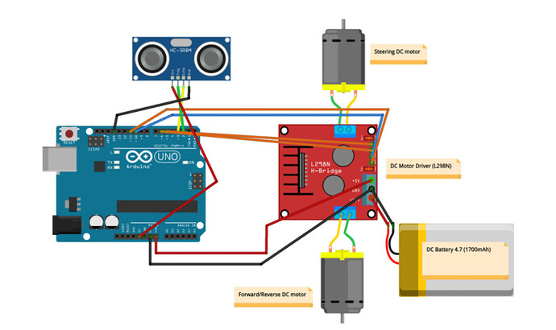

---

# **Object-Follower-Bot**

## **Description**  
This project involves building an ultrasonic object-tracking robot that follows objects using an **HC-SR04 ultrasonic sensor**. The robot is powered by **Arduino** and controlled via the **L298N motor driver**. The system detects objects and follows them, stopping when the object is no longer within a detectable range.

---

## **Key Features**
- Uses the **HC-SR04 ultrasonic sensor** to detect and follow objects.
- Controlled by **Arduino Uno/Nano**.
- **L298N Motor Driver** for controlling the DC motors.
- Simple setup, ideal for beginners.
- Stops when no object is detected within the sensor's range.

---

## **Components**

| **Component**            | **Quantity** | **Description**                                                        |
|--------------------------|--------------|------------------------------------------------------------------------|
| **Arduino Uno/Nano**      | 1            | Microcontroller that controls the entire robot.                        |
| **HC-SR04 Ultrasonic Sensor** | 1            | Sensor that measures distance using sound waves.                       |
| **L298N Motor Driver**    | 1            | Controls the two DC motors based on Arduino signals.                  |
| **DC Motors with Wheels** | 2            | Motors that provide movement to the robot.                             |
| **9V/12V Battery**        | 1            | Powers the motors and the Arduino.                                    |
| **Robot Chassis**         | 1            | Holds the components and provides structure for the robot.            |
| **Jumper Wires**          | Several      | Used to make connections between components.                           |
| **Breadboard (optional)** | 1            | Can be used for easy connections, though not necessary for this setup. |

---

## **Circuit Diagram**

Here’s a simple wiring diagram to help you connect the components:

- **HC-SR04 Ultrasonic Sensor:**
  - VCC → 5V (Arduino)
  - GND → GND (Arduino)
  - TRIG → Pin 8 (Arduino)
  - ECHO → Pin 9 (Arduino)

- **L298N Motor Driver:**
  - IN1 → Pin 2 (Arduino)
  - IN2 → Pin 3 (Arduino)
  - IN3 → Pin 4 (Arduino)
  - IN4 → Pin 5 (Arduino)
  - +12V → Battery (+)
  - GND → Battery (GND) and Arduino GND
  - Out1 → Motor 1 (+)
  - Out2 → Motor 1 (-)
  - Out3 → Motor 2 (+)
  - Out4 → Motor 2 (-)



---

## **How It Works**
1. **Distance Measurement**:  
   The **HC-SR04 ultrasonic sensor** emits a pulse through its **TRIG** pin and listens for the **ECHO** pin to return. The Arduino calculates the distance based on the return time of the pulse.
   
2. **Movement Control**:  
   - If an object is detected within a specified range, the robot moves forward.
   - If the object moves out of range, the robot stops.

3. **Motor Driver**:  
   The **L298N motor driver** receives commands from the Arduino to control the direction of the motors. Depending on the ultrasonic sensor's input, the robot moves or halts.

---

## **Code**

The following **Arduino code** will control the robot's movements based on the distance measured by the ultrasonic sensor:

```cpp
#include <NewPing.h>

#define TRIGGER_PIN 8
#define ECHO_PIN 9
#define MAX_DISTANCE 200

NewPing sonar(TRIGGER_PIN, ECHO_PIN, MAX_DISTANCE);
int motor1Pin1 = 2; 
int motor1Pin2 = 3;
int motor2Pin1 = 4; 
int motor2Pin2 = 5;

void setup() {
  pinMode(motor1Pin1, OUTPUT);
  pinMode(motor1Pin2, OUTPUT);
  pinMode(motor2Pin1, OUTPUT);
  pinMode(motor2Pin2, OUTPUT);
  Serial.begin(9600);
}

void loop() {
  delay(50);
  int distance = sonar.ping_cm();
  Serial.print("Distance: ");
  Serial.print(distance);
  Serial.println("cm");

  if (distance > 0 && distance <= 50) {
    moveForward();
  } else {
    stopMovement();
  }
}

void moveForward() {
  digitalWrite(motor1Pin1, HIGH);
  digitalWrite(motor1Pin2, LOW);
  digitalWrite(motor2Pin1, HIGH);
  digitalWrite(motor2Pin2, LOW);
}

void stopMovement() {
  digitalWrite(motor1Pin1, LOW);
  digitalWrite(motor1Pin2, LOW);
  digitalWrite(motor2Pin1, LOW);
  digitalWrite(motor2Pin2, LOW);
}
```

---

## **Steps to Build the Robot**

### **Step 1: Assemble the Chassis**
1. Attach the **DC motors** to the robot chassis.
2. Mount the **wheels** onto the motors.
3. Attach the **ultrasonic sensor** at the front of the robot.

### **Step 2: Wiring**
- Follow the circuit diagram to connect the components:
  - **HC-SR04 sensor** to **Arduino**.
  - **L298N motor driver** to the motors and **Arduino**.
  - **Power connections** to both Arduino and motors.

### **Step 3: Upload the Code**
- Open the **Arduino IDE**.
- Connect the Arduino board via USB.
- Copy the provided code and upload it to the board.

### **Step 4: Test the Robot**
- Turn on the robot by powering it with the battery.
- Place an object in front of the sensor, and observe how the robot moves forward.
- Move the object away, and the robot will stop.

---

## **License**
This project is open-source and licensed under the [MIT License](LICENSE).

---

## **Troubleshooting**

| **Issue**                | **Solution**                                                       |
|--------------------------|---------------------------------------------------------------------|
| **No movement**           | Check if motors are connected to the correct motor driver pins.   |
| **Incorrect distance reading** | Verify the ultrasonic sensor is positioned correctly. |
| **Robot does not stop**   | Ensure the **ECHO** and **TRIG** pins are connected properly to the Arduino. |
| **Motor not working**     | Test the motor driver connections and verify power supply.       |

---

## **Additional Features to Explore**
- **Add Obstacle Avoidance**: Use additional ultrasonic sensors on the sides of the robot to avoid obstacles.
- **Speed Control**: Implement **PWM (Pulse Width Modulation)** to control the motor speed based on distance.
- **Bluetooth Control**: Add a **Bluetooth module (HC-05)** for manual control from a mobile phone.

---

This guide provides all the necessary details to assemble, program, and troubleshoot your **Object-Follower-Bot**. Let me know if you need further clarifications or adjustments!
